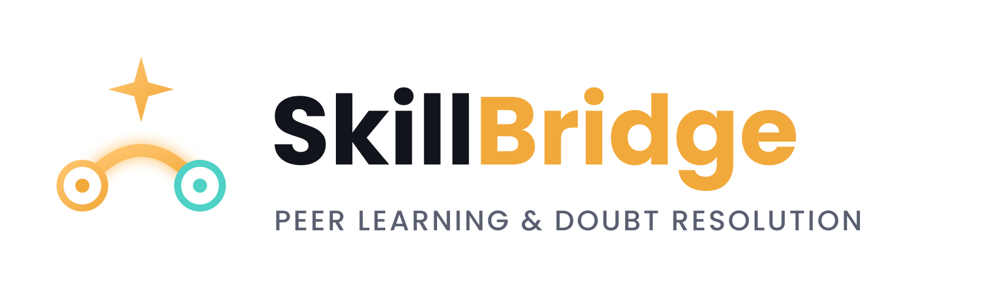

<p align="center">
  
</p>

## SkillBridge — Peer Learning & Doubt Resolution Platform

A full-stack MERN application where students post doubts, get matched in real time with peers who list matching skills, answer each other's questions, and build reputation through a StackOverflow-style upvote/accept system. Includes AI-powered starter hints (google gemini) for students who want a nudge in the right direction before a human answers.

---

## Tech Stack

| Layer      | Technology                                          |
|------------|------------------------------------------------------|
| Frontend   | React 18, Vite, React Router, Tailwind CSS, Axios, Socket.io-client |
| Backend    | Node.js, Express, Socket.io                          |
| Database   | MongoDB + Mongoose (text search, indexes)             |
| Auth       | JWT (JSON Web Tokens), bcrypt password hashing        |
| Real-time  | Socket.io (private notification rooms, live typing indicator) |
| AI         | Google Gemini API (LLM-powered answer hints, free tier)|

---

## Core Features

1. **JWT Authentication** — register/login, protected routes, auto-logout on token expiry.
2. **Real-time Doubt-Matching** — when a question is posted, the backend finds users whose
   skill `tags` overlap with the question's tags and pushes a live Socket.io notification
   to each of them (visible instantly as a toast, no page refresh).
3. **Reputation System** — a small scoring algorithm: +2 reputation per answer upvote,
   +15 reputation when your answer is accepted as the solution. Reputation unlocks badges
   (`Contributor` → `Problem Solver` → `Mentor` → `SkillBridge Legend`).
4. **Search & Filtering** — MongoDB text index across title/description/tags, plus
   filters for "Unanswered" and "Most Upvoted".
5. **Live Typing Indicator** — while someone is drafting an answer, other viewers on the
   same question see "X is typing an answer..." in real time.
6. **Leaderboard & Profiles** — public profile pages showing a user's questions, answers,
   badges, and reputation; a global leaderboard ranked by reputation.
7. **Fully Responsive UI** — custom Tailwind design system (see below), works from mobile
   to desktop.
8. **LLM-Powered Answer Hints** — on any question page, a user can request an AI-generated
   starter hint (Google Gemini API) before waiting for a human answer. The hint is deliberately
   a *nudge*, not a full solution, and is cached in MongoDB after first generation so
   repeat views don't re-call the API.

---

## Project Structure

```
skillbridge/
├── backend/
│   ├── config/
│   │   └── db.js                     # MongoDB connection
│   ├── models/
│   │   ├── User.js                   # reputation, badges, skill tags
│   │   ├── Question.js               # includes cached aiSuggestion field
│   │   ├── Answer.js
│   │   └── Notification.js
│   ├── controllers/
│   │   ├── authController.js         # register, login, get profile
│   │   ├── questionController.js     # CRUD + search + doubt-matching
│   │   ├── answerController.js       # CRUD + upvote + accept (reputation logic)
│   │   ├── userController.js         # profile, leaderboard, notifications
│   │   └── aiController.js           # Gemini API call for answer hints
│   ├── routes/
│   │   ├── authRoutes.js
│   │   ├── questionRoutes.js         # includes /:id/ai-suggestion
│   │   ├── answerRoutes.js
│   │   └── userRoutes.js
│   ├── middleware/
│   │   ├── authMiddleware.js         # JWT auth guard
│   │   └── errorMiddleware.js        # centralized error handler
│   ├── socket/
│   │   └── socketHandler.js          # Socket.io connection/room logic
│   ├── utils/
│   │   └── generateToken.js
│   ├── server.js                     # App entry point
│   ├── package.json
│   └── .env.example
└── frontend/
    ├── src/
    │   ├── api/
    │   │   └── axios.js              # Axios instance + auth interceptor
    │   ├── context/
    │   │   ├── AuthContext.jsx
    │   │   └── SocketContext.jsx     # live notification toasts
    │   ├── components/
    │   │   ├── Navbar.jsx
    │   │   ├── QuestionCard.jsx
    │   │   ├── AISuggestionCard.jsx  # AI hint button + display
    │   │   ├── NotificationDropdown.jsx
    │   │   ├── Avatar.jsx
    │   │   ├── TagPill.jsx
    │   │   └── ProtectedRoute.jsx
    │   ├── pages/
    │   │   ├── Home.jsx              # browse, search, filter, pagination
    │   │   ├── Login.jsx
    │   │   ├── Register.jsx
    │   │   ├── AskQuestion.jsx
    │   │   ├── QuestionDetail.jsx    # answers, AI hint, typing indicator
    │   │   ├── Leaderboard.jsx
    │   │   ├── Profile.jsx
    │   │   └── NotFound.jsx
    │   ├── App.jsx                   # routing
    │   ├── main.jsx                  # entry point
    │   └── index.css                 # Tailwind directives + custom classes
    ├── index.html
    ├── tailwind.config.js            # custom design tokens (see Design section)
    ├── postcss.config.js
    ├── vite.config.js
    ├── package.json
    └── .env.example
```

---

## Design System

The visual direction is a "late-night study lamp" theme — a dark ink background with
a warm amber glow, fitting a platform students use while debugging at 1 AM.

| Token         | Hex       | Use                          |
|---------------|-----------|-------------------------------|
| `ink`         | `#12141C` | Page background                |
| `paper`       | `#1B1F2A` | Card surfaces                  |
| `amber`       | `#F2A93B` | Primary accent (buttons, glow) |
| `teal`        | `#4FD1C5` | Resolved / accepted state      |
| `coral`       | `#F2685C` | Open / urgent state            |

Fonts: **Space Grotesk** (headings), **Inter** (body text), **JetBrains Mono** (code snippets).

Signature detail: each question card has a colored left border — coral (open), amber
(answered), teal (resolved) — like a highlighter mark in a notebook margin.

---

## Talking Points for Interviews

- *"Built a full MERN stack app with real-time features using Socket.io — when a user
  posts a question, the backend matches it against other users' skill tags and pushes
  a live notification, without any polling."*
- *"Designed and implemented a reputation/scoring algorithm from scratch — similar to
  StackOverflow's system — with tiered badge unlocks based on accumulated points."*
- *"Used MongoDB text indexes for search and compound queries for tag/status filtering."*
- *"Handled auth with JWT + bcrypt, protected routes on both the Express API and React
  Router, and used Axios interceptors for automatic token attachment and 401 handling."*
- *"Styled the entire UI with a custom Tailwind design system — no default component
  library — including a full responsive layout."*
- *"Integrated the Google Gemini API to generate starter hints for stuck students — designed
  the prompt to nudge rather than solve outright, and cached responses in MongoDB to
  avoid redundant API calls and control cost."*

---

## Possible Future Extensions (v2 ideas)
- Video/voice doubt sessions via WebRTC
- Email digests for unanswered questions
- Admin moderation dashboard
